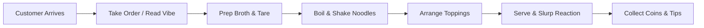
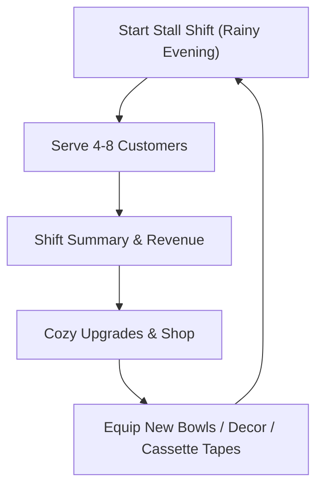
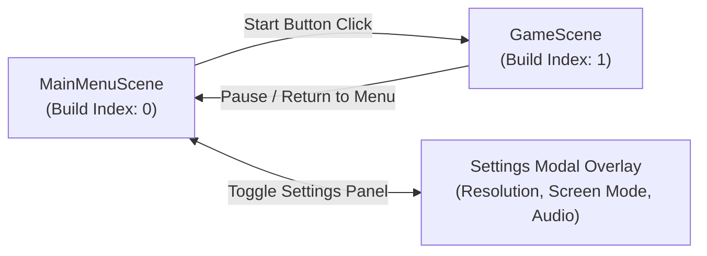

# Game Design Document (GDD)
# Vibe Cooking: Lo-Fi Ramen Shop

---

## 1. Executive Summary & Core Pillars

### 1.1 High Concept
**Vibe Cooking** is a cozy, low-stress, tactile 2D ramen cooking and management game. Players run an intimate, late-night street-side ramen stall tucked into a quiet rainy alleyway. Through tactile drag-and-drop interactions, satisfying ASMR audio cues, and chilled lo-fi beats, players craft custom ramen bowls, serve relaxing customers, earn coins, and upgrade both their kitchen and the stall's aesthetic vibe.

### 1.2 Target Audience & Platform
* **Platform:** PC / Mac (Unity 2D, mouse-driven or touch-ready).
* **Target Audience:** Fans of cozy games (*Good Pizza, Great Pizza*, *Coffee Talk*, *Dorfromantik*, *Unpacking*), lo-fi aesthetic enthusiasts, and players seeking relaxing, non-punitive task loops.

### 1.3 The 3 Core Pillars

```
+-------------------------------------------------------------------------+
|                               CORE PILLARS                              |
+------------------------------------+------------------------------------+
| 1. Stress-Free Tactile Crafting    | Cooking feels physical, tactile,   |
|                                    | and juicy. No harsh failure timers |
|                                    | or game-over screens.              |
+------------------------------------+------------------------------------+
| 2. Deep Lo-Fi Sensory Immersion    | ASMR kitchen sound effects,        |
|                                    | interactive radio, rain ambiance,  |
|                                    | steam, and warm neon lighting.     |
+------------------------------------+------------------------------------+
| 3. Modular "Vibe Coding" Design    | Codebase decoupled into clean,     |
|                                    | isolated ScriptableObjects and     |
|                                    | event-driven components.           |
+------------------------------------+------------------------------------+
```

---

## 2. Core Gameplay Loops

### 2.1 Micro Loop (Per Customer Order)



### 2.2 Macro Loop (Session Progression)



---

## 3. Scene Flow & Main Menu Architecture

The game uses a two-scene architecture separating frontend navigation and settings from active gameplay:



### 3.1 Scene Hierarchy & Setup
1. **`Assets/Scenes/MainMenuScene.unity` (Build Index 0):**
   * Default starting scene when the game launches.
   * Houses the title branding, background mood visuals, menu buttons, and the settings modal panel.
2. **`Assets/Scenes/GameScene.unity` (Build Index 1):**
   * The core cooking counter gameplay scene.

---

### 3.2 Main Menu Interface & Interactions

#### Layout & Presentation:
* **Background:** Cozy late-night alleyway exterior of the ramen stall with soft rain falling and glowing paper lanterns (`bg_main_menu.png` or an animated 2D camera).
* **Title Logo:** Stylized warm neon logo reading **"Vibe Cooking"** with a gentle idle pulsing glow.
* **Vertical Navigation Buttons:**
  * **START:**
    * Plays a soft button click audio (`sfx_btn_click.wav`).
    * Triggers a smooth fade-to-black transition $\to$ loads `GameScene` via `SceneManager.LoadScene("GameScene")`.
  * **SETTINGS:**
    * Opens the **Settings Modal Panel** as an animated popup overlay.
  * **EXIT:**
    * Exits the game via `Application.Quit()`.
    * In Unity Editor Play Mode: handles `#if UNITY_EDITOR UnityEditor.EditorApplication.isPlaying = false; #endif`.

---

### 3.3 Settings Modal Panel Specification

The Settings panel allows players to configure display and sound preferences with full `PlayerPrefs` persistence.

```
+-------------------------------------------------------------+
|                      [X] SETTINGS                           |
+-------------------------------------------------------------+
|  DISPLAY                                                    |
|  ---------------------------------------------------------  |
|  Resolution:    [ 1920 x 1080 (16:9)                   ▼ ]  |
|  Screen Mode:   [ Fullscreen | Borderless | Windowed   ▼ ]  |
|                                                             |
|  AUDIO                                                      |
|  ---------------------------------------------------------  |
|  Master Volume: [======O----------------] 60%               |
|  BGM (Music):   [========O--------------] 70%               |
|  SFX (ASMR):    [==========O------------] 85%               |
|                                                             |
|                    [ BACK / SAVE ]                          |
+-------------------------------------------------------------+
```

#### A. Display / Screen Options
1. **Resolution Dropdown:**
   * Populated dynamically at runtime via `Screen.resolutions`.
   * Filters out refresh rate duplicates and standardizes to the user's supported aspect ratios (e.g., `1920x1080`, `1600x900`, `1366x768`, `1280x720`).
   * Automatically selects the player's current resolution upon launch.
2. **Screen Mode (Window Mode) Dropdown / Radio:**
   * **Fullscreen:** `FullScreenMode.ExclusiveFullScreen` (or `FullScreenWindow`).
   * **Borderless Windowed:** `FullScreenMode.FullScreenWindow`.
   * **Windowed:** `FullScreenMode.Windowed`.
   * Executed via:
     ```csharp
     Screen.SetResolution(selectedWidth, selectedHeight, selectedScreenMode);
     ```

#### B. Audio Options (Volume Sliders)
* **Master Volume Slider (0.0 to 1.0, Default: 0.8):** Global volume multiplier.
* **BGM Volume Slider (0.0 to 1.0, Default: 0.7):** Adjusts background lo-fi tracks.
* **SFX Volume Slider (0.0 to 1.0, Default: 0.85):** Adjusts tactile ASMR cooking and customer sounds.
* **Audio Implementation:** Applied through an `AudioMixer` using logarithmic attenuation:
  ```csharp
  float dB = (sliderValue > 0.001f) ? Mathf.Log10(sliderValue) * 20f : -80f;
  audioMixer.SetFloat("MasterVolume", dB);
  ```

#### C. Persistence & Settings Manager
* All settings save automatically on modification or when clicking **Back / Save** using `PlayerPrefs`:
  * `ResolutionWidth`, `ResolutionHeight`, `ScreenMode`, `MasterVol`, `BgmVol`, `SfxVol`.
* A persistent `SettingsManager.cs` (`DontDestroyOnLoad`) loads and applies these settings at game launch before the menu renders.

---

## 4. Screen Layout & Counter Spatial Design

The game is viewed from a **single fixed 2D orthographic perspective** (eye-level customer counter with an angled top-down view of the prep counter below).

```
+------------------------------------------------------------------------+
| [Rainy Window / Alleyway Background with Warm Swaying Lanterns]        |
|                                                                        |
|                 [CUSTOMER AREA: 1-2 Stools at Counter]                |
|                    [Customer Sprite & Mood Bubble]                     |
|                                                                        |
| [ORDER TICKET RACK]                                   [LO-FI CASSETTE] |
| (Hangs from top counter)                              [RADIO PLAYER]   |
+========================================================================+
|                        PREPARATION COUNTER                             |
|                                                                        |
|  [BROTH POTS]       [NOODLE BASKETS]              [TOPPING TRAYS]      |
|  - Shoyu Pot        - Basket 1 (Boiling Water)    - Chashu   - Tamago  |
|  - Tonkotsu Pot     - Basket 2 (Boiling Water)    - Menma    - Nori    |
|  - Miso Pot                                       - Naruto   - Scallion|
|                                                                        |
|                 [ASSEMBLY ZONE (ACTIVE BOWL)]                          |
|                 - Ceramic Bowl Workspace                               |
|                 - Ladle / Strainer Interaction                         |
|                 - [SERVE BELL / BUTTON]                                |
+------------------------------------------------------------------------+
```

---

## 5. Detailed Cooking & Station Mechanics

Cooking in *Vibe Cooking* is split into 4 tactile stations. Each station focuses on responsive animation, juicy audio, and intuitive mouse gestures.

### 5.1 Station A: The Bowl & Broth Station

#### Interaction & Mechanics:
1. **Spawn Bowl:** A ceramic bowl rests in the center assembly zone.
2. **Select Tare / Sauce Base (Optional Layer):** Click and drag a condiment spoon (e.g., Soy sauce tare, spicy chili paste, garlic oil) into the bottom of the bowl.
3. **Pour Broth:**
   * Player clicks & holds the ladle above the selected Broth Pot (e.g., Shoyu, Tonkotsu, Miso).
   * Drag the filled ladle over the bowl and release.
   * **Visual:** Broth smoothly fills the bowl to 40% capacity with a gentle liquid swirl and rising steam particles.
   * **Audio:** Deep soup scoop sound $\to$ rich liquid pouring ASMR.
   * **State Change:** `BowlState.HasBroth = true; BowlState.BrothType = Shoyu;`

---

### 5.2 Station B: The Noodle Station (Timer & Water Shake)

#### Interaction & Mechanics:
1. **Drop Noodles:** Click a raw noodle bundle from the prep board and drop it into an open boiling basket.
2. **Boiling & Firmness Gauge:**
   * A gentle circular or curved gauge appears above the basket.
   * **Firmness Windows:**
     * `0s - 3s:` Raw (Too crunchy)
     * `3s - 6s:` **Kata** (Firm / Al Dente)
     * `6s - 10s:` **Futsuu** (Standard / Perfect)
     * `10s - 14s:` **Yawa** (Soft)
     * `> 14s:` Overcooked (Very soft; customers still accept it with gentle commentary, but lower presentation score).
3. **The Shake Gesture (Tactile Flourish):**
   * Click and drag the basket upward out of the boiling water.
   * Shake the mouse up and down 2–3 times (or rapid double-click) to snap water droplets off the strainer.
   * **Audio:** Sizzling water droplet snap + metallic mesh rattle.
4. **Plunge into Broth:**
   * Drag the strained basket over the bowl and release.
   * **Visual:** Noodles fold into the broth with an animated noodle splash; surface ripple shader activates.
   * **State Change:** `BowlState.HasNoodles = true; BowlState.NoodleFirmness = Futsuu;`

---

### 5.3 Station C: Topping & Plating Station (Drag-and-Drop Freedom)

Toppings sit in organized bamboo or stainless steel ingredient trays along the right side of the counter.

#### Available Initial Ingredients:
* **Chashu Pork:** Sliced roasted pork belly (1–3 slices).
* **Ajitsuke Tamago:** Soft-boiled marinated egg split in half showing a glossy orange yolk.
* **Menma:** Seasoned fermented bamboo shoots.
* **Nori:** Crisp dark green seaweed sheets (tucks into the bowl rim).
* **Narutomaki:** Classic white fish cake with a pink swirl.
* **Scallions / Negi:** Chopped green onions (scattered using a sprinkle cursor).

#### Placement Logic:
* **Freeform with Soft Snapping:** Players can drop toppings anywhere inside the bowl radius.
* **Sorting Order:** Layered correctly so toppings sit on top of noodles and broth.
* **Presentation Bonus:** Placing ingredients symmetrically or neatly clustered grants a `NeatnessBonus` (+10% tip).

---

### 5.4 Station D: Serving & Customer Reaction

1. Once satisfied, the player drags the completed bowl to the customer's counter space (or clicks the brass **Serve Bell**).
2. The active customer leans forward:
   * **Animation:** Picks up chopsticks, steam billows from the bowl.
   * **Audio:** Distinct, satisfying slurping sound (`slurp_delight.wav`), followed by a satisfied sigh.
   * **Feedback:** Hearts or stars burst above their head.
   * **Payment:** Customer places silver/gold coins on the counter with a crisp clinking sound (`coin_clink.wav`).
   * Player clicks/sweeps the coins to collect them into their wallet.

---

## 6. Customer & Order System

### 6.1 Customer Archetypes & Vibe Dialogues

Customers are designed to feel like regulars in a peaceful late-night manga:

| Archetype | Description | Order Style | Example Order / Dialogue |
| :--- | :--- | :--- | :--- |
| **The Night Coder** | Hoodie, dark circles under eyes, laptop bag. Needs energy and comfort. | Vibe / Mood order | *"I've been debugging a race condition for 6 hours... please give me rich Tonkotsu with extra garlic and firm noodles."* |
| **The Rainy Traveler** | Transparent umbrella, trench coat, looking for warmth. | Descriptive order | *"It's pouring out there. A piping hot Miso ramen with extra chashu would save my life."* |
| **The High School Regular** | Cheerful, uniform, loves visual appeal. | Specific order | *"Classic Shoyu Ramen with naruto, egg, and extra scallions! Make it pretty for my photo!"* |
| **The Stray Calico Cat** | Sits on the end stool occasionally on quiet nights. | Simple treat | Orders just a slice of Chashu in a small dish. Rewards the player with a lucky charm or rare coin. |

### 6.2 Scoring & Tip Algorithm

Evaluation is transparent, encouraging, and never punishing:

$$\text{Final Payout} = \text{Base Price} + \text{Accuracy Bonus} + \text{Firmness Bonus} + \text{Presentation Bonus}$$

* **Base Price:** Determined by broth and base noodle cost (e.g., ¥800).
* **Accuracy Bonus (0 - 100%):** Correct broth type and requested toppings present.
* **Firmness Match (+¥150):** Noodles cooked to customer's requested firmness window.
* **Presentation Bonus (+¥100):** Ingredients spaced out cleanly rather than piled in a messy single stack.
* **Patience Penalty:** **None.** Customers do not leave or get angry; they simply sip complimentary barley tea while waiting.

---

## 7. The "Lo-Fi Vibe" & Sensory Systems

### 7.1 ASMR Sound Design Palette
Audio is a core pillar of the game. Every action has dedicated, high-fidelity tactile audio:

* `broth_simmer_ambient.wav`: Soft, continuous loop of simmering broth pots.
* `ladle_dip.wav` & `broth_pour.wav`: Wet, warm scoop and liquid flow.
* `noodle_boil_bubble.wav`: Rapid boiling water bubbling in the boiler.
* `strainer_shake.wav`: Snappy droplets snapping off the wire mesh.
* `topping_place.wav`: Soft wet slap when chashu or egg touches the broth.
* `bell_ding.wav`: Gentle brass counter bell.
* `slurp_happy.wav`: Deeply satisfying ramen slurp.
* `rain_on_window.wav`: Gentle background rainfall loop with optional soft thunder.

### 7.2 The Interactive Lo-Fi Cassette Player
* A retro cassette tape player sits on the right corner of the counter.
* **Controls:**
  * Click **Play / Pause**.
  * Click **Next Track** / **Previous Track**.
  * Volume dial (adjusts BGM without affecting ASMR SFX).
* **Progression:** Players can buy new cassette tapes in the shop containing unique chillhop, jazzhop, and ambient guitar tracks.

---

## 8. Economy & Upgrade Shop

Between service shifts (or accessible via a small ledger notebook on the counter), players spend their earned Yen:

### 8.1 Kitchen Upgrades
* **Twin Noodle Boiler:** Adds a 2nd noodle basket to prep two orders simultaneously.
* **Thermal Broth Keepers:** Improves broth visual effects and pouring speed.
* **Sous-Vide Chashu Torch:** Unlocks a mini blowtorch tool to sear chashu slices directly in the bowl for +¥120 tip per bowl.

### 8.2 Ingredient Unlocks
* **Level 1 (Default):** Shoyu Broth, Thin Noodles, Chashu, Scallions, Tamago Egg.
* **Level 2:** Tonkotsu Broth, Menma (Bamboo Shoots), Nori Sheets.
* **Level 3:** Miso Broth, Spicy Chili Rayu, Narutomaki Fishcake, Butter Corn.

### 8.3 Stall Decor & Vibe Upgrades
* **Ceramic Bowls:** Unlock *Classic Indigo Wave*, *Matte Charcoal*, *Sakura Blossom Pink*.
* **Atmospheric Lighting:** Dim warm Edison bulbs, paper chochin lanterns, fairy string lights.
* **Desk Accents:** Maneki-Neko (Lucky Cat that purrs when clicked), Bonsai plant, vintage ceramic teapot.
* **Mixtapes:** 4 collectible cassette tapes featuring distinct cozy lo-fi tracks.

---

## 9. Modular Technical Architecture (Unity 2D / C#)

To support seamless "vibe coding" across multiple development prompts and chats, the codebase is structured around **ScriptableObjects** and **loose event decoupling**:

```
Assets/
├── _Project/
│   ├── Scripts/
│   │   ├── Core/               # Game state, Service Loop, Economy, SettingsManager, SceneLoader
│   │   ├── Data/               # ScriptableObjects (Recipes, Ingredients, Customers)
│   │   ├── Stations/           # BrothStation, NoodleStation, PlatingStation
│   │   ├── Items/              # Bowl, IngredientInstance, NoodleBasket
│   │   ├── Customer/           # CustomerAgent, OrderTicket, DialogueUI
│   │   ├── Vibe/               # LoFiRadio, RainController, SteamFX
│   │   └── UI/                 # MainMenuController, SettingsPanelUI, HUD, ShopModal, ScorePopup
│   ├── ScriptableObjects/
│   │   ├── Ingredients/
│   │   ├── Recipes/
│   │   ├── Customers/
│   │   └── MusicTracks/
│   ├── Prefabs/
│   ├── Art/
│   └── Audio/
```

### 9.1 Key ScriptableObjects

1. **`IngredientDataSO`**
   * `string id`
   * `string displayName`
   * `Sprite icon`
   * `Sprite bowlVisual`
   * `IngredientType type` (Broth, Noodle, Meat, Veggie, Garnish)
   * `AudioClip placeSound`

2. **`RecipeDataSO`**
   * `string recipeName`
   * `IngredientDataSO requiredBroth`
   * `NoodleFirmness requiredFirmness`
   * `List<IngredientDataSO> requiredToppings`
   * `int basePrice`

3. **`CustomerDataSO`**
   * `string customerName`
   * `Sprite portrait`
   * `List<string> arrivalDialogues`
   * `List<string> satisfactionDialogues`
   * `List<RecipeDataSO> favoriteRecipes`

### 9.2 Event-Driven Architecture (C# Actions)
Modules communicate via a centralized `GameEvents` hub to prevent tight coupling:
* `GameEvents.OnOrderCreated(OrderTicket order)`
* `GameEvents.OnBowlUpdated(BowlInstance bowl)`
* `GameEvents.OnOrderServed(BowlInstance bowl, CustomerAgent customer)`
* `GameEvents.OnMoneyChanged(int totalYen, int delta)`
* `GameEvents.OnTrackChanged(MusicTrackSO newTrack)`

---

## 10. Phased Implementation Roadmap (For Vibe Coding)

This roadmap defines the strict order of implementation for future coding sessions:

### **Phase 1: Minimal Viable Prototype (Core Assembly MVP & Main Menu)**
* **Goal:** A complete foundational flow: Boot into Main Menu, configure display/sound settings, start game, prepare a ramen bowl, serve a customer, and earn coins.
* **Scope:**
  * **Main Menu & Settings (Separate Scene):**
    * Setup `MainMenuScene.unity` (Build Index 0) and `GameScene.unity` (Build Index 1).
    * `MainMenuController.cs`:
      * **Start:** Transitions smoothly to `GameScene.unity`.
      * **Settings:** Opens the Settings Modal Panel.
      * **Exit:** Calls `Application.Quit()` (with Unity Editor exit support).
    * `SettingsPanelUI.cs` & `SettingsManager.cs`:
      * **Screen Settings:** Dynamic Resolution dropdown (from `Screen.resolutions`) + Screen Mode (Fullscreen, Borderless, Windowed).
      * **Audio Settings:** Master Volume, BGM Volume, and SFX Volume sliders.
      * **Persistence:** Auto-save to and restore from `PlayerPrefs`.
  * **Core In-Game Ramen Cooking Loop:**
    * Single 2D Counter Scene layout with placeholder sprites.
    * 1 Broth Pot (Click to fill bowl with broth).
    * 1 Noodle Basket (Drop noodle bundle, boil timer, drop into bowl).
    * 3 Toppings (Drag-and-drop: Chashu, Egg, Scallions).
    * 1 Customer arriving at counter with simple ticket order.
    * Serve button $\to$ Accuracy validation $\to$ Coin reward popup.

### **Phase 2: Tactile Feel & Sensory Polish (The "Vibe" Layer)**
* **Goal:** Make the prototype feel deeply satisfying and lo-fi.
* **Scope:**
  * Broth fluid pouring visual + steam particle FX.
  * Noodle shake water-droplet animation.
  * Freeform topping placement with rotation & layer sorting.
  * Full ASMR sound integration (boiling, ladle, chop, slurp, coin clink).
  * Interactive Lo-Fi Radio on counter with 2 playable tracks.
  * Cozy background visuals (rain particles on window, glowing lantern).

### **Phase 3: Customer Variety & Mood System**
* **Goal:** Deepen emotional connection and order variety.
* **Scope:**
  * 4 Customer Archetypes with expressive portraits.
  * Mood-based orders (*"I need something warm and spicy"*).
  * Noodle firmness preferences (Kata / Futsuu / Yawa).
  * Plating neatness evaluation bonus.

### **Phase 4: Progression, Shop & Customization**
* **Goal:** Give long-term goals and player expression.
* **Scope:**
  * End-of-shift ledger modal (earnings breakdown).
  * In-game Upgrade Shop (unlock new toppings, bowl skins, and cassettes).
  * Persistent save system (PlayerPrefs / JSON for coins & unlocked items).
  * Stall customization (choose active bowl skin and desk plant).

---

## 11. Complete Asset Production Manifest & Specifications

This manifest lists every required asset needed across art, audio, visual effects, and music. Assets are categorized with exact specifications, naming conventions, and phase priorities for easy generation or sourcing.

### 10.1 2D Visual & Sprite Assets

#### A. Environment & Stall Background
| Asset ID / Filename | Description | Format & Size | Phase Priority |
| :--- | :--- | :--- | :--- |
| `bg_alleyway_night.png` | Late-night cozy alleyway backdrop, wet pavement reflecting soft neon. | 1920x1080 (or 640x360 pixel art), 16:9 | Phase 2 |
| `fg_counter_wood.png` | Rustic, warm-toned wooden ramen bar counter with grain texture. | 1920x540 (Bottom half overlay) | **Phase 1 (MVP)** |
| `overlay_rain_window.png` | Soft translucent rain droplets & glass streak layer. | 1920x1080 PNG (semi-transparent) | Phase 2 |
| `prop_lantern_warm.png` | Hanging Japanese paper chochin lantern (lit glowing frame + unlit). | 256x512 PNG | Phase 2 |
| `prop_noren_curtain.png` | Japanese doorway fabric split curtain with stall crest. | 512x256 PNG | Phase 3 |

#### B. Cookware & Counter Stations
| Asset ID / Filename | Description | Format & Size | Phase Priority |
| :--- | :--- | :--- | :--- |
| `bowl_ceramic_default.png` | Traditional off-white/indigo-rim ramen bowl (empty base). | 512x512 PNG | **Phase 1 (MVP)** |
| `bowl_ceramic_charcoal.png`| Matte black artisan ceramic ramen bowl (skin unlock). | 512x512 PNG | Phase 4 |
| `bowl_ceramic_sakura.png`  | Soft pastel pink cherry-blossom bowl (skin unlock). | 512x512 PNG | Phase 4 |
| `pot_broth_shoyu.png`      | Stainless steel stockpot with simmering amber soy broth. | 384x384 PNG | **Phase 1 (MVP)** |
| `pot_broth_tonkotsu.png`   | Stockpot with creamy milky-white pork bone broth. | 384x384 PNG | Phase 3 |
| `pot_broth_miso.png`       | Stockpot with rich golden-brown miso broth. | 384x384 PNG | Phase 3 |
| `pot_noodle_boiler.png`    | Rectangular hot water vat with steam vents. | 512x384 PNG | **Phase 1 (MVP)** |
| `strainer_basket_empty.png`| Cylindrical wire mesh noodle strainer basket (wooden handle).| 256x384 PNG | **Phase 1 (MVP)** |
| `strainer_basket_filled.png`| Strainer basket loaded with boiling noodles. | 256x384 PNG | **Phase 1 (MVP)** |
| `ladle_broth.png`          | Deep wooden or stainless soup ladle for scooping broth. | 128x384 PNG | **Phase 1 (MVP)** |
| `tray_bamboo_ingredient.png`| Small wooden trays holding toppings along the right counter. | 256x256 PNG | **Phase 1 (MVP)** |
| `bell_counter_brass.png`   | Vintage brass counter bell (idle and pressed down frames). | 128x128 PNG | **Phase 1 (MVP)** |

#### C. Ingredients & Toppings (Tray Sprite + In-Bowl Plating Sprite)
| Ingredient | Tray Icon (`ing_[name]_tray.png`) | In-Bowl Sprite (`ing_[name]_plated.png`) | Phase Priority |
| :--- | :--- | :--- | :--- |
| **Noodles (Raw Bundle)** | `ing_noodle_raw.png` (Raw folded bundle) | `ing_noodle_broth_layer.png` (Noodle bed in broth) | **Phase 1 (MVP)** |
| **Chashu Pork** | `ing_chashu_tray.png` (Stack of slices) | `ing_chashu_plated.png` (Tender braised pork slice) | **Phase 1 (MVP)** |
| **Ajitsuke Tamago** | `ing_tamago_tray.png` (Bowl of marinated eggs) | `ing_tamago_plated.png` (Halved egg, glossy yolk) | **Phase 1 (MVP)** |
| **Scallions / Negi** | `ing_scallion_tray.png` (Chopped green onions) | `ing_scallion_plated.png` (Scattered herb sprinkle) | **Phase 1 (MVP)** |
| **Menma** | `ing_menma_tray.png` (Bamboo shoot strips) | `ing_menma_plated.png` (Seasoned bamboo cluster) | Phase 3 |
| **Nori** | `ing_nori_tray.png` (Crisp dark seaweed stack) | `ing_nori_plated.png` (Seaweed tucked into rim) | Phase 3 |
| **Narutomaki** | `ing_naruto_tray.png` (Fish cake slices) | `ing_naruto_plated.png` (Pink spiral fish cake slice)| Phase 3 |
| **Butter Corn** | `ing_corn_tray.png` (Sweet corn & butter pat) | `ing_corn_plated.png` (Golden corn cluster) | Phase 4 |

#### D. Characters & Customers
*Sprites need 3 expressive poses: `_idle` (waiting), `_slurp` (eating), and `_happy` (smiling/paying).*

| Customer ID | Name & Persona | Format & Size | Phase Priority |
| :--- | :--- | :--- | :--- |
| `char_night_coder` | **The Night Coder** (Tired developer, hoodie, headphones). | 512x512 PNG (3 frames) | **Phase 1 (MVP)** |
| `char_rainy_traveler` | **The Rainy Traveler** (Trenchcoat, clear umbrella). | 512x512 PNG (3 frames) | Phase 3 |
| `char_school_regular` | **High School Regular** (Cheerful student, bag with pins).| 512x512 PNG (3 frames) | Phase 3 |
| `char_calico_cat` | **Stray Calico Cat** (Cute cat sitting on end stool). | 256x256 PNG (3 frames) | Phase 4 |

#### E. Interactive Props & Decor
| Asset ID / Filename | Description | Format & Size | Phase Priority |
| :--- | :--- | :--- | :--- |
| `prop_cassette_radio.png` | Retro 80s boombox/cassette player with functional buttons. | 384x256 PNG | Phase 2 |
| `item_cassette_tape_01` to `04` | Collectible colorful cassette tapes with lo-fi labels. | 128x80 PNG | Phase 2 & 4 |
| `prop_maneki_neko.png` | Japanese ceramic lucky cat with animated waving paw. | 256x256 PNG (2 frames) | Phase 4 |
| `prop_bonsai_tree.png` | Little bonsai in a ceramic pot for the counter corner. | 256x256 PNG | Phase 4 |

#### F. UI & HUD Elements
| Asset ID / Filename | Description | Format & Size | Phase Priority |
| :--- | :--- | :--- | :--- |
| `ui_main_menu_bg.png` | Late-night exterior ramen stall backdrop for Main Menu. | 1920x1080 PNG | **Phase 1 (MVP)** |
| `ui_title_logo.png` | "Vibe Cooking" stylized neon / cozy typography logo. | 800x400 PNG | **Phase 1 (MVP)** |
| `ui_btn_menu_normal.png` / `_hover.png` | Cozy wooden / rounded menu button frames. | 384x96 PNG | **Phase 1 (MVP)** |
| `ui_panel_settings.png` | Dark wooden / paper texture modal dialog for Settings. | 800x600 PNG | **Phase 1 (MVP)** |
| `ui_slider_elements.png` | Slider track, fill, and round handle for Volume controls. | Sprite atlas | **Phase 1 (MVP)** |
| `ui_dropdown_frame.png` | Cozy framed dropdown box for Resolution & Screen Mode. | 9-sliced PNG | **Phase 1 (MVP)** |
| `ui_ticket_order.png` | Hanging aged paper order slip with wooden clothespin clip. | 256x384 PNG | **Phase 1 (MVP)** |
| `ui_speech_bubble.png` | Cozy dialogue bubble with soft rounded corners. | 9-sliced PNG | **Phase 1 (MVP)** |
| `ui_coins_sprite_sheet.png`| Copper (¥10), Silver (¥100), Gold (¥500) coin sprites. | 64x64 PNG per coin | **Phase 1 (MVP)** |
| `ui_gauge_noodle_firmness` | Curved circular meter with Kata/Futsuu/Yawa colored zones. | 256x256 PNG | Phase 2 |
| `ui_panel_wood_ledger.png` | Open notebook ledger for the end-of-shift shop & stats. | 800x600 PNG | Phase 4 |
| `ui_star_rating.png` | Golden rating star icon (empty & filled states). | 64x64 PNG | **Phase 1 (MVP)** |

---

### 11.2 VFX & Particle Systems

| VFX Asset ID | Visual Description | Implementation | Phase Priority |
| :--- | :--- | :--- | :--- |
| `fx_steam_ambient` | Wispy, warm rising steam from hot broth pots and ready bowl. | Unity Particle System | Phase 2 |
| `fx_boiling_bubbles`| Tiny water bubbles popping on the surface of the boiler vat. | Unity Particle System | Phase 2 |
| `fx_water_droplets_shake`| Crisp water droplets flying off the mesh when shaking basket. | Unity Particle System | Phase 2 |
| `fx_rain_streaks` | Ambient rain drops gliding diagonally outside the stall. | Unity Particle System | Phase 2 |
| `fx_hearts_sparkle` | Pink hearts and golden sparkles popping when customer reacts. | Unity Particle System | **Phase 1 (MVP)** |
| `fx_coin_shine` | Gentle glint/shimmer on coins sitting on the counter. | Sprite sheet animation | Phase 2 |

---

### 11.3 Audio Assets (ASMR SFX & Ambience)

*All audio files should be 44.1 kHz, 16-bit WAV (uncompressed) for immediate responsiveness and high clarity.*

#### A. Ambient Loops
| Sound File | Sound Description & Mood | Loop? | Phase Priority |
| :--- | :--- | :--- | :--- |
| `amb_rain_window_loop.wav` | Gentle rain falling on canvas awning & window glass. | Yes | Phase 2 |
| `amb_water_boiling_loop.wav` | Subdued rumble of boiling water in the noodle vat. | Yes | Phase 2 |
| `amb_broth_simmer_loop.wav`| Low, warm simmer of deep broth stockpots. | Yes | Phase 2 |
| `amb_night_alley_distant.wav`| Very quiet night breeze, distant soft city drone. | Yes | Phase 4 |

#### B. Kitchen & Tactile ASMR SFX
| Sound File | Sound Description & Action Triggered | Phase Priority |
| :--- | :--- | :--- |
| `sfx_ladle_scoop.wav` | Thick liquid scooped up with hollow wooden ladle. | **Phase 1 (MVP)** |
| `sfx_broth_pour.wav` | Warm, satisfying liquid stream pouring into ceramic bowl. | **Phase 1 (MVP)** |
| `sfx_noodle_drop_basket.wav`| Splash and sizzle of cold raw noodles hitting boiling water. | **Phase 1 (MVP)** |
| `sfx_strainer_shake.wav` | Crisp metallic mesh rattle + water droplets snapping off. | Phase 2 |
| `sfx_noodle_plop_broth.wav`| Soft wet plop as cooked noodles land into the soup base. | **Phase 1 (MVP)** |
| `sfx_topping_place_soft.wav`| Gentle wet slap when meat/egg touches the broth surface. | **Phase 1 (MVP)** |
| `sfx_scallion_scatter.wav` | Crisp leafy flutter of chopped scallions being sprinkled. | **Phase 1 (MVP)** |
| `sfx_blowtorch_sear.wav` | Focused gas flame hiss with subtle chashu sizzle. | Phase 4 |
| `sfx_bell_ding.wav` | Clean, resonant brass desk bell ding (*ding!*). | **Phase 1 (MVP)** |

#### C. Customer, UI & Menu SFX
| Sound File | Sound Description & Action Triggered | Phase Priority |
| :--- | :--- | :--- |
| `sfx_btn_click.wav` | Soft tactile click on menu buttons and settings toggles. | **Phase 1 (MVP)** |
| `sfx_customer_door_chime.wav`| Little wind chime or counter greeting as customer steps up. | Phase 2 |
| `sfx_order_ticket_snap.wav` | Crisp paper rustle when an order ticket appears on the rack. | **Phase 1 (MVP)** |
| `sfx_ramen_slurp_delight.wav`| Energetic, authentic, delicious noodle slurp. | **Phase 1 (MVP)** |
| `sfx_customer_sigh_happy.wav`| Gentle "ahh~" of warmth and satisfaction after eating. | Phase 2 |
| `sfx_coin_drop_counter.wav` | Crisp metallic clink of coins placed on the wooden bar. | **Phase 1 (MVP)** |
| `sfx_coin_sweep_collect.wav`| Satisfying coin sweep & wallet deposit chime. | **Phase 1 (MVP)** |
| `sfx_cat_purr_meow.wav` | Soft, sleepy cat meow and rhythmic purr. | Phase 4 |

#### D. Cassette Player & Radio SFX
| Sound File | Sound Description & Action Triggered | Phase Priority |
| :--- | :--- | :--- |
| `sfx_radio_cassette_click.wav` | Heavy mechanical latch click of a retro cassette deck. | Phase 2 |
| `sfx_radio_tape_whir.wav` | 0.8s spooling tape motor whir before music starts. | Phase 2 |
| `sfx_radio_static_blip.wav` | Gentle vinyl crackle / radio tuner blip between tracks. | Phase 2 |

---

### 11.4 Music Soundtracks (Lo-Fi Chillhop Beats)

*Format: High-quality MP3 / OGG loop (BPM ~70–85), master volume leveled to sit gently beneath cooking SFX.*

| Track Title | BPM / Key | Style & Instrumentation | Phase Priority |
| :--- | :--- | :--- | :--- |
| **Track 01: "Midnight Drizzle"** | 76 BPM / Eb Minor | Warm acoustic piano, subtle vinyl crackle, gentle sub-bass, soft rim-shots. | **Phase 1 (MVP default)** |
| **Track 02: "Neon Broth"** | 82 BPM / C Major | Vintage Rhodes electric piano, dusty boom-bap drums, cozy muted trumpet. | Phase 2 |
| **Track 03: "Alleyway Lanterns"**| 72 BPM / A Minor | Nylon jazz guitar picking, tape-saturated hip-hop kick, soft rain foley layer. | Phase 3 |
| **Track 04: "Bugfix at 3 AM"** | 78 BPM / F# Minor | Analog synth pad swells, gentle 808 percussion, mellow late-night study groove.| Phase 4 |

---

### 11.5 Phase 1 (MVP) Asset Checklist Summary

To start building immediately without waiting for hundreds of assets, here is the **absolute minimum list (MVP)** to generate or placeholder:

#### Scenes & Flow
* [ ] `MainMenuScene.unity` (Build Index 0)
* [ ] `GameScene.unity` (Build Index 1)

#### Main Menu & UI Assets
* [ ] `ui_main_menu_bg.png` (Alleyway night exterior)
* [ ] `ui_title_logo.png` ("Vibe Cooking" title logo)
* [ ] `ui_btn_menu_normal.png` / `_hover.png` (Start, Settings, Exit buttons)
* [ ] `ui_panel_settings.png` (Settings modal panel frame)
* [ ] `ui_slider_elements.png` & `ui_dropdown_frame.png` (Volume sliders & resolution dropdown)

#### In-Game Counter & Cookware
* [ ] `fg_counter_wood.png` (Wood counter surface)
* [ ] `bowl_ceramic_default.png` (Ramen bowl)
* [ ] `pot_broth_shoyu.png` (Shoyu pot)
* [ ] `pot_noodle_boiler.png` + `strainer_basket_empty.png` (Noodle boiler & basket)

#### Ingredients & Customer
* [ ] 4 Ingredient Sprites: `ing_noodle_raw.png`, `ing_chashu_plated.png`, `ing_tamago_plated.png`, `ing_scallion_plated.png`
* [ ] 1 Customer: `char_night_coder` (Idle & Eating frames)
* [ ] In-Game UI: `ui_ticket_order.png`, `ui_coin_silver.png`, `ui_speech_bubble.png`, `bell_counter_brass.png`

#### Audio (SFX & Music)
* [ ] 1 UI SFX: `sfx_btn_click.wav`
* [ ] 6 Core Kitchen SFX: `sfx_ladle_scoop`, `sfx_broth_pour`, `sfx_noodle_plop_broth`, `sfx_topping_place_soft`, `sfx_ramen_slurp_delight`, `sfx_coin_drop_counter`
* [ ] 1 Music Track: `Track 01: "Midnight Drizzle"`

